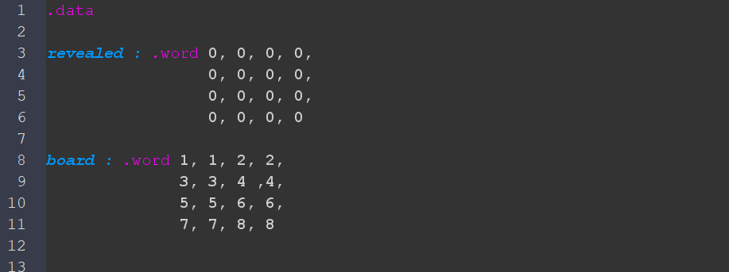
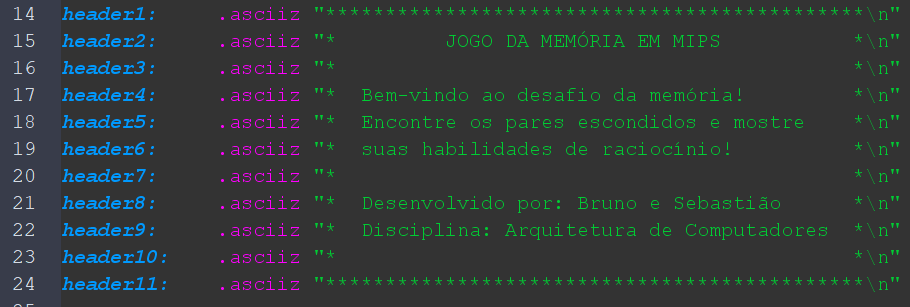
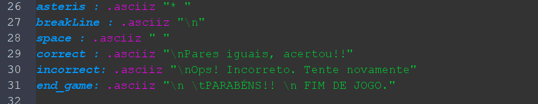
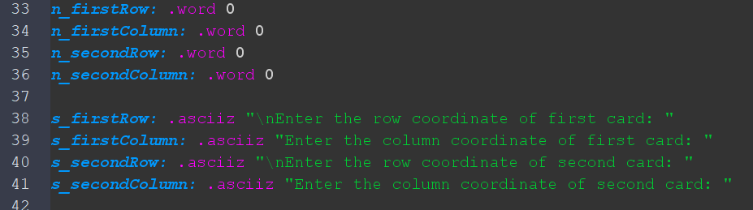
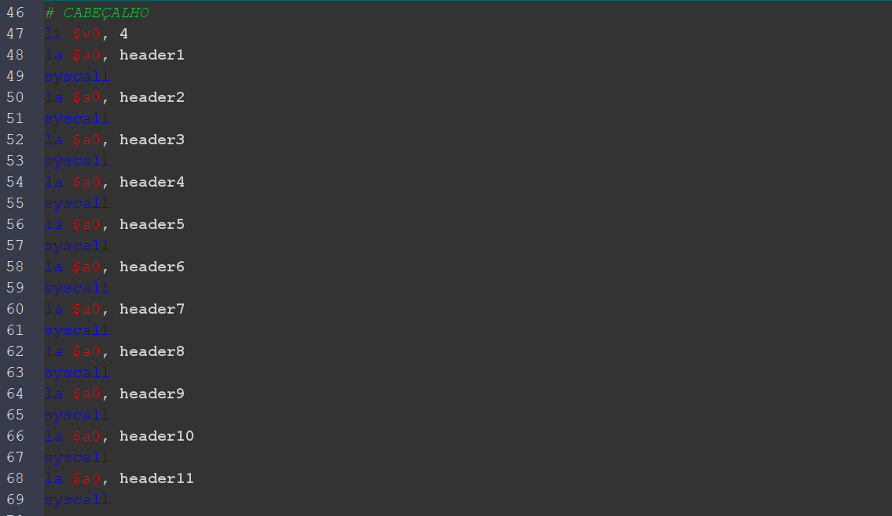
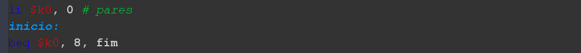
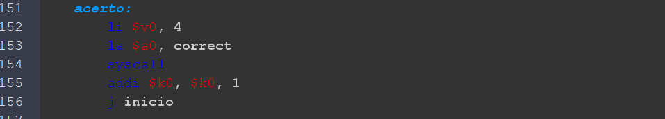

# Jogo da Memória em Assembly MIPS

## Súmario
- [Sobre o projeto](#sobre-o-projeto)
- [Equipe](#equipe)
- [Simulador](#simulador)
- [Funcionamento do jogo](#funcionamento-do-jogo)
- [Implementação do Jogo](#implementação-do-jogo)

  

## Sobre o projeto
  Este projeto foi desenvolvido na disciplina de Arquitetura de Computadores do curso de Bacharelado em Ciência da Computação na Universidade Federal do Cariri (UFCA). Seu objetivo é implementar um Jogo da Memória em Assembly MIPS, utilizando um tabuleiro 4x4 onde cada posição contém um número, e cada número aparece em duas cartas diferentes. O funcionamento do jogo consiste em selecionar duas posições por vez; se as cartas forem iguais, elas permanecem reveladas; caso contrário, são novamente ocultadas. O jogo encerra quando todos os pares são descobertos.
  
  
  
## Equipe
  - [Bruno Macedo (GitHub)](https://github.com/brunom-dev);
  - [Sebastião Soares (GitHub)](https://github.com/sebastiaosoares);
  - **Professor:** [Ramon Nepomuceno (e-mail institucional)](mailto:ramon.nepomuceno@ufca.edu.br).
  
  
  
## Simulador
  O jogo foi desenvolvido e testado utilizando o MARS (MIPS Assembler and Runtime Simulator), um ambiente que permite simular a execução de programas Assembly MIPS. ([Download](https://dpetersanderson.github.io/download.html) - Link externo).

  

## Funcionamento do jogo
  O jogo da memória é baseado na mecânica tradicional, onde o jogador precisa encontrar pares de cartas iguais. No início, todas as cartas estão ocultas e são organizadas em uma matriz de 4x4, contendo 8 pares de símbolos. Neste caso, os símbolos são números inteiros.
  
  ### Como jogar ?
  1. O jogador escolhe duas cartas por vez, informando suas coordenadas (linha e coluna).
  2. Para cada nova jogada, o usuário terá que inserir:
       - A linha e a coluna da primeira carta
       - A linha e a coluna da segunda carta
  3. Se as cartas escolhidas forem iguais, elas permanecem visíveis.
  4. Se forem diferentes, ambas são ocultadas novamente.
  5. O jogo continua até que todas as 8 duplas de cartas sejam encontradas.

  

## Implementação do jogo
A Implementação foi desenvolvida utilizando Assembly MIPS e executado no simulador MARS. A mesma segue uma estrutura baseada em memória, onde o tabuleiro e o estado das cartas são armazenados em arrays. O jogo segue um fluxo contínuo de interação com o usuário, solicitando coordenadas e verificando pares até que todas as combinações sejam encontradas.

### Declaração e Inicialização dos dados na memória.

Inicialmente, declaramos e inicializamos as variáveis que iriamos precisar durante o desenvolvimento do jogo no bloco de codigo reservado <code>data</code>. Sendo elas: Duas matrizes (Matriz das Cartas e Matriz do Status das cartas), Variáveis contendo conteudo do cabeçalho, Variáveis contendo conteúdo para exibir resultados, e por fim Variáveis com as perguntas das coordenadas e para as armazenar as coordenadas que o usuário inserir. 

     
   <i> Image 1 - Declaração e Inicilização das Matrizes das Cartas e Status</i>

 

     
    <i> Image 2 - Declaração e Inicilização das Variaveis para o cabeçalho</i>

 

     
    <i> Image 3 - Declaração e Inicilização das Variaveis para exibição de resultados</i>

 

     
   <i> Image 4 - Declaração e Inicilização das variaveis para exibição e armazemento das inserções do usuário</i>

 

 

### Boas Vindas e Funcionamento do Loop principal
O programa inicia exibindo um cabeçalho de boas-vindas e, em seguida, entra no loop principal, onde o jogador insere as coordenadas das cartas. Após cada tentativa, o tabuleiro é atualizado e exibido novamente, permitindo ao jogador visualizar as cartas reveladas e escondidas.

O loop principal verifica se o numero total de pares revelados é igual a 8, que corresponderia ao FIM DO JOGO, tendo que o jogo inicializa em um registrador <code>$k0</code> o conteudo da quantidade de pares revelados sendo 0 (zero). E a cada acerto do usuário, ou seja a cada a revelação de duas cartas com contéudo igual, é incrementado 1 (um) ao conteúdo desse mesmo registrador <code>$k0</code>.

     
   <i> Image 5 - Exibição do cabeçalho</i>

 

     
   <i> Image 6 - Inicilização do Registrador dos pares e Condição do Loop</i>

 

     
   <i> Image 7 - Operações em caso de acerto</i>

 

### Função de exibição do tabuleiro 