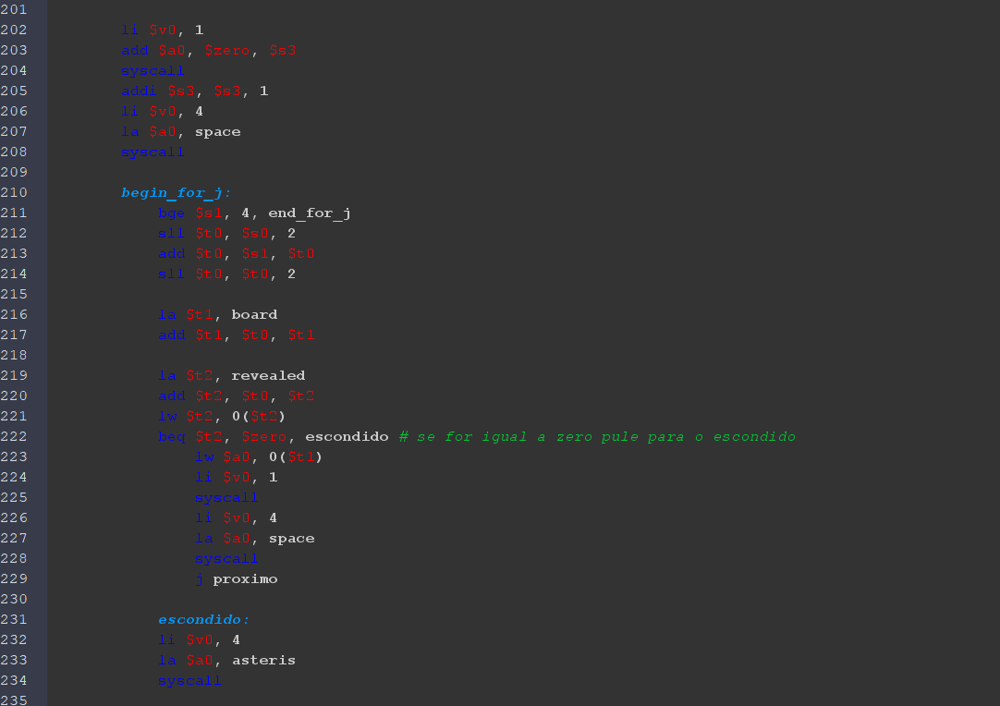

# Jogo da Memória em Assembly MIPS

## Súmario
- [Sobre o projeto](#sobre-o-projeto)
- [Equipe](#equipe)
- [Simulador](#simulador)
- [Funcionamento do jogo](#funcionamento-do-jogo)
- [Implementação do Jogo](#implementação-do-jogo)

  

## Sobre o projeto
  Este projeto foi desenvolvido na disciplina de Arquitetura de Computadores do curso de Bacharelado em Ciência da Computação na Universidade Federal do Cariri (UFCA). Seu objetivo é implementar um Jogo da Memória em Assembly MIPS, utilizando um tabuleiro 4x4 onde cada posição contém um número, e cada número aparece em duas cartas diferentes. O funcionamento do jogo consiste em selecionar duas posições por vez; se as cartas forem iguais, elas permanecem reveladas; caso contrário, são novamente ocultadas. O jogo encerra quando todos os pares são descobertos.
  
  
  
## Equipe
  - [Bruno Macedo (GitHub)](https://github.com/brunom-dev);
  - [Sebastião Soares (GitHub)](https://github.com/sebastiaosoares);
  - **Professor:** [Ramon Nepomuceno (e-mail institucional)](mailto:ramon.nepomuceno@ufca.edu.br).
  
  
  
## Simulador
  O jogo foi desenvolvido e testado utilizando o MARS (MIPS Assembler and Runtime Simulator), um ambiente que permite simular a execução de programas Assembly MIPS. ([Download](https://dpetersanderson.github.io/download.html) - Link externo).

  

## Funcionamento do jogo
  O jogo da memória é baseado na mecânica tradicional, onde o jogador precisa encontrar pares de cartas iguais. No início, todas as cartas estão ocultas e são organizadas em uma matriz de 4x4, contendo 8 pares de símbolos. Neste caso, os símbolos são números inteiros.
  
  ### Como jogar ?
  1. O jogador escolhe duas cartas por vez, informando suas coordenadas (linha e coluna).
  2. Para cada nova jogada, o usuário terá que inserir:
       - A linha e a coluna da primeira carta
       - A linha e a coluna da segunda carta
  3. Se as cartas escolhidas forem iguais, elas permanecem visíveis.
  4. Se forem diferentes, ambas são ocultadas novamente.
  5. O jogo continua até que todas as 8 duplas de cartas sejam encontradas.

  

## Implementação do jogo
A Implementação foi desenvolvida utilizando Assembly MIPS e executado no simulador MARS. A mesma segue uma estrutura baseada em memória, onde o tabuleiro e o estado das cartas são armazenados em arrays. O jogo segue um fluxo contínuo de interação com o usuário, solicitando coordenadas e verificando pares até que todas as combinações sejam encontradas.

### Declaração e Inicialização dos dados na memória.

Inicialmente, declaramos e inicializamos as variáveis que iriamos precisar durante o desenvolvimento do jogo no bloco de codigo reservado <code>data</code>. Sendo elas: Duas matrizes (Matriz das Cartas e Matriz do Status das cartas), Variáveis contendo conteudo do cabeçalho, Variáveis contendo conteúdo para exibir resultados, e por fim Variáveis com as perguntas das coordenadas e para as armazenar as coordenadas que o usuário inserir. 

     
   <i> Image 1 - Declaração e Inicilização das Matrizes das Cartas e Status</i>

 

     
    <i> Image 2 - Declaração e Inicilização das Variaveis para o cabeçalho</i>

 

     
    <i> Image 3 - Declaração e Inicilização das Variaveis para exibição de resultados</i>

 

     
   <i> Image 4 - Declaração e Inicilização das variaveis para exibição e armazemento das inserções do usuário</i>

 

 

### Boas Vindas e Funcionamento do Loop principal
O programa inicia exibindo um cabeçalho de boas-vindas e, em seguida, entra no loop principal, onde o jogador insere as coordenadas das cartas. Após cada tentativa, o tabuleiro é atualizado e exibido novamente, permitindo ao jogador visualizar as cartas reveladas e escondidas.

O loop principal verifica se o numero total de pares revelados é igual a 8, que corresponderia ao FIM DO JOGO, tendo que o jogo inicializa em um registrador <code>$k0</code> o conteudo da quantidade de pares revelados sendo 0 (zero). E a cada acerto do usuário, ou seja a cada a revelação de duas cartas com contéudo igual, é incrementado 1 (um) ao conteúdo desse mesmo registrador <code>$k0</code>.

     
   <i> Image 5 - Exibição do cabeçalho</i>

 

     
   <i> Image 6 - Inicilização do Registrador dos pares e Condição do Loop</i>

 

     
   <i> Image 7 - Operações em caso de acerto</i>

 

### Função de exibição do tabuleiro 

A função display_board tem a responsabilidade de exibir o tabuleiro do jogo da memória, permitindo que o jogador visualize quais cartas já foram reveladas e quais ainda permanecem ocultas. Para isso, ela percorre a matriz do tabuleiro e imprime seus valores de forma organizada na tela. 

Inicialmente, a função imprime algumas quebras de linha para formatar a saída e melhorar a legibilidade. Em seguida, exibe os números das colunas, que servem como referência para que o jogador possa inserir corretamente as coordenadas das cartas. Depois disso, a função entra em um loop que percorre cada linha do tabuleiro. Para cada linha, primeiramente, é impresso o número correspondente àquela linha, facilitando a identificação pelo jogador. 

Em seguida, outro loop percorre as colunas dessa linha, verificando se a carta naquela posição já foi revelada, onde essa verificação é realizada a partir do endereco do elemento atual, como cada elemento da matriz de status corresponde a proprio elemento da matriz de cartas, nos possibilita utilizar o mesmo indice para verificar o status da carta correspondente.Se a carta foi revelada, ou seja, se o valor correspondente na matriz Status (revealed) for diferente de zero, seu número real é impresso na tela. Caso contrário, um asterisco (*) é exibido, indicando que a carta ainda está oculta. Para iteração sobre os elementos das matrizes foi utilizada uma pequena manipulação do indice do FOR, onde o elemento que queriamos imprimir tinha como endereço a seguinte manipulação: 

<b>Endereco do primeiro elemento + [(i*4 + j) * 4] = Endereco do elemento atual na iteração.</b>

Por fim, a função adiciona mais uma quebra de linha para manter a organização visual do tabuleiro na tela. Dessa forma, sempre que o jogo atualiza o estado do tabuleiro, o jogador pode facilmente identificar os pares que já encontrou.

A função não possui retorno, apenas faz a exibição e retorna para o endereço da instrução armazenada no registrador <code>$ra</code>

   
   
    
   <i> Image 8 - Função dusplay_board</i>

 

### Loop principal

O loop principal controla todo o funcionamento do jogo, desde a coleta das coordenadas das cartas até a verificação de pares e a finalização do jogo. Ele garante que o jogador possa interagir de forma contínua até que todas as cartas tenham sido encontradas.

Ele inicia verificando se o jogador já encontrou todos os pares. Isso é feito comparando a variável de controle ($k0), que mantém a contagem de pares encontrados, com o valor 8, correspondente ao número total de pares no tabuleiro. Se todos os pares forem encontrados, o jogo exibe uma mensagem de conclusão e termina a execução.

Caso contrário, o jogo continua pedindo ao jogador que insira as coordenadas de duas cartas. Primeiro, são solicitados os valores de linha e coluna da primeira carta. Esses valores são lidos, armazenados na memória e usados para acessar a matriz cartas (board), que contém os números das cartas, onde o endereco dessa carta é armazenado no registrador <code>$s5</code>, e a matriz status (revealed), que controla quais cartas estão visíveis, onde é o valor é alterado para 1 indicando que está revelado. Em seguida, o mesmo processo ocorre para a segunda carta, neste caso o endereço da segunda carta é armazenado no registrador <code>$s7</code>.

Após obter as coordenadas das duas cartas, ambas são temporariamente reveladas no tabuleiro, e a função display_board é chamada novamente para exibir a atualização. Então, os valores dessas cartas são carregados da matriz board e comparados. Se forem iguais, significa que o jogador encontrou um par correto, e as cartas permanecem visíveis. Caso contrário, as cartas são ocultadas novamente, e o jogo prossegue.

O loop continua até que todos os pares tenham sido encontrados. A cada iteração, o tabuleiro é atualizado para mostrar o progresso do jogador.

   
   
    
   <i> Image 9 - Main</i>

 